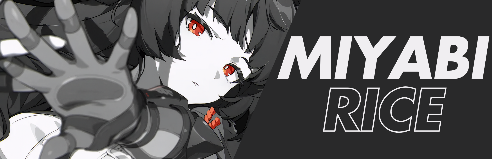

<!-- <h1>MIyabi Hyprland</h1> -->

    

    First time rice, made with Arch Linux Hyprland. 
    Entirely based on instinct.  
    <b>Disclaimer:</b> Configured and tested on an Axioo Hype 5 AMD X3 laptop.

---

## 📦 Programs

A curated list of programs and tools used in this setup.

| Component          | Program                                                                                 |
|--------------------|-----------------------------------------------------------------------------------------|
| **Window Manager** 🪟 | [Hyprland](https://github.com/hyprwm/Hyprland)                                        |
| **Terminal** 🖥️      | [Kitty](https://github.com/kovidgoyal/kitty)                                           |
| **Sddm** 🎗️        | [Astronaut-Theme](https://github.com/Keyitdev/sddm-astronaut-theme)                       |                        |
| **Shell** 🐚         | [Zsh](https://github.com/ohmyzsh/ohmyzsh/wiki/Installing-ZSH) + [Powerlevel10k](https://github.com/romkatv/powerlevel10k) |
| **Editor** 📝        | [Neovim](https://github.com/neovim/neovim) + [NvChad](https://github.com/NvChad/NvChad) |
| **Editor** 📝        | [VSCode](https://aur.archlinux.org/packages/visual-studio-code-bin)                    |
| **Visualizer** 📊    | [Cava](https://github.com/karlstav/cava)                                               |
| **Gaming** 🎮        | [Steam](https://store.steampowered.com/)                                               |
| **Other Tools** 🗿   | -                                                                                     |

---

## 📷 Preview

    

---

## 🎲 More Screenshots

    

    

    

---

## 📝 Inspired By

- **Minimal Bocchi**  
  Some configurations were adapted from [MinimalBocchi](https://github.com/Spelljinxer/dotfiles).  

---
