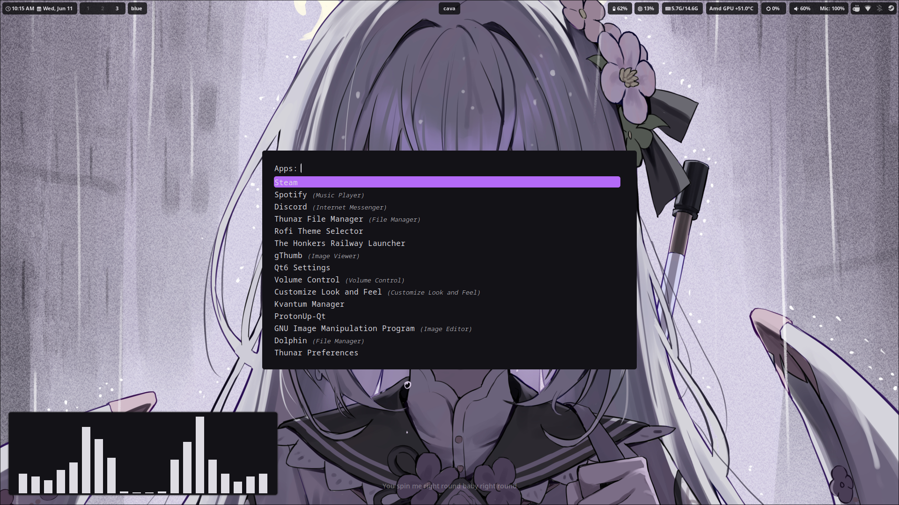

<!-- <h1 align="center"> Miyabi Hyprland</h1> -->

    

First time Rice, Made with Arch Linux Hyprland   And only made based on instinct.  <b>Disclaimer: Made with Axioo Hype 5 AMD X3 laptop.</b>

## 📦 Programs

List of programs and tools I use.

| Component         | Program    |
|-------------------|------------|
| Windows Manager 🪟| [hyprland](https://github.com/hyprwm/Hyprland)  |
| Terminal 🖥️       | [kitty](https://github.com/kovidgoyal/kitty)        |
| Shell 🐚          | [zsh](https://github.com/ohmyzsh/ohmyzsh/wiki/Installing-ZSH) / [theme](https://github.com/romkatv/powerlevel10k) |
| Editor 📝         | [neovim](https://github.com/neovim/neovim) / [nvchad](https://github.com/NvChad/NvChad)     |
| Editor 📝         | [vscode](https://aur.archlinux.org/packages/visual-studio-code-bin)|
| Visualiser 📊     | [cava](https://github.com/karlstav/cava)          |
| Game🎮            | [Steam](https://store.steampowered.com/)       |
| Etc🗿             |               |

## 📷 Preview

## 🎲 More

    

    

    

## 📝 Inspired From
- **Minimal Bocchi** - I used some configurations from there: [MinimalBocchi] (https://github.com/Spelljinxer/dotfiles)
