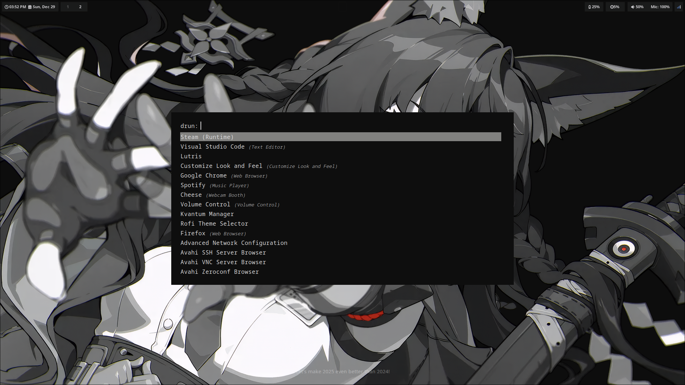
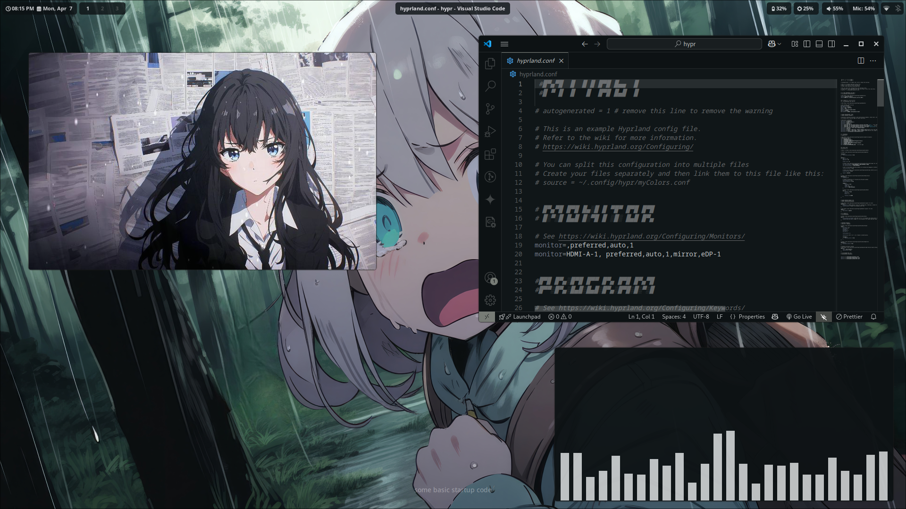

# Miyabi Theme


[](https://ko-fi.com/ryoxzd)

<strong>Miyabi</strong> is a handcrafted, minimal Hyprland rice for Arch Linux.<br>
Designed with balance — fast, focused, and beautiful.<br><br>
<em>Tested on:</em> Axioo Hype 5 Amd X3

---

## 📷 Screenshots

<table align="center">
  <tr>
    <td align="center"></td>
    <td align="center"></td>
    <td align="center"></td>
  </tr>
</table>

---

## Installation 
You’ll need:
- Arch Linux (or Arch-based distro)
- Active internet connection
- `git` installed

1. Clone This Repository
```sh
git clone https://github.com/ryoxzd/dotfiles.git
```

2. Run The Installation
```sh
./install.sh
```

The script will install dependencies, set up configs, and prepare Hyprland for you. Follow any prompts shown in the terminal.

After installation, reboot or relog into Hyprland — and enjoy Miyabi.

---

### Philosophy
> “Just enough. Nothing more.”

This is not just a rice — it's a personal environment. You're welcome to fork, remix, or draw inspiration. Have fun customizing it your way.

